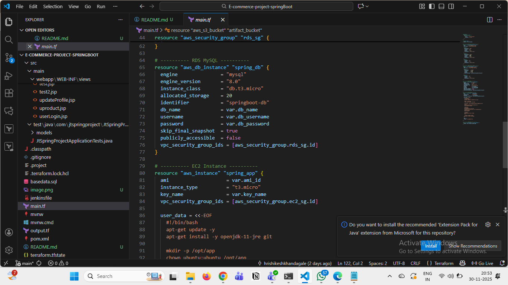
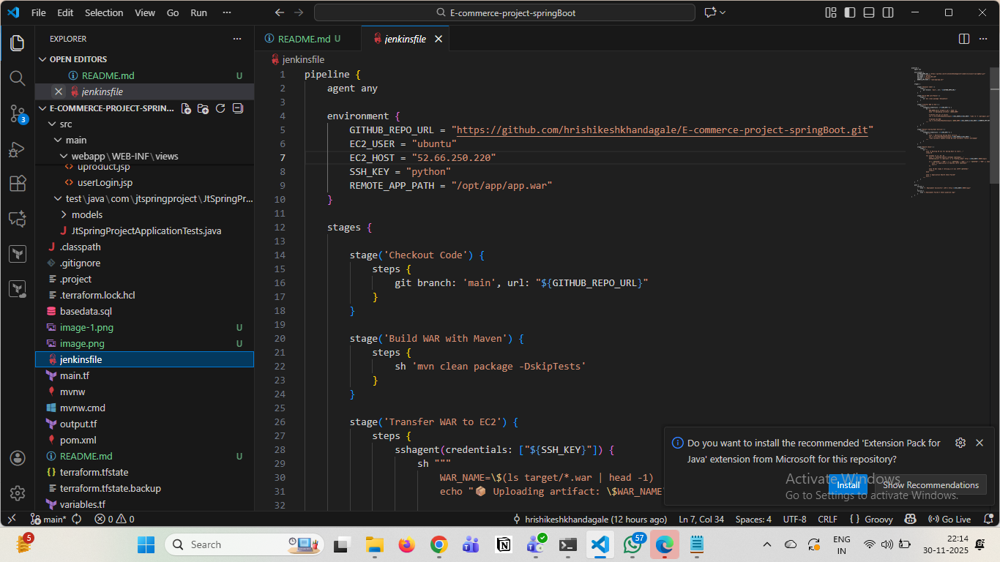
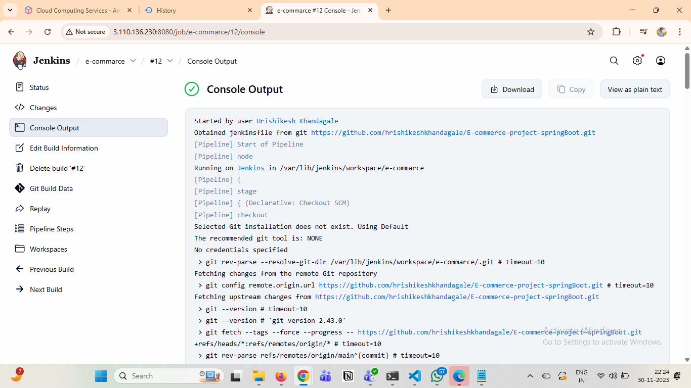

# E-Commerce Spring Boot Application Deployment

Complete guide for deploying E-Commerce Spring Boot application on AWS EC2 with RDS using Terraform and Jenkins CI/CD.

## Project Overview

This project automates the deployment of a Spring Boot e-commerce application with:
- **Infrastructure**: AWS EC2 + RDS using Terraform
- **CI/CD**: Jenkins Pipeline with GitHub webhook
- **Database**: MySQL on AWS RDS
- **Automation**: Systemd service for auto-restart

## Prerequisites

- AWS Account with appropriate permissions
- Terraform installed (v1.0+)
- Jenkins server setup
- GitHub account
- Java 11+ and Maven installed locally

## Architecture

```
GitHub → Jenkins → Build (Maven) → Deploy to EC2 → Connect to RDS
                     ↓
                  S3 Bucket (Artifacts)
```

## Project Structure
```
.
├── terraform/
│   ├── main.tf
│   ├── variables.tf
│   ├── outputs.tf
│   ├── ec2.tf
│   ├── rds.tf
│   ├── security-groups.tf
│   └── user-data.sh
├── jenkins/
│   └── Jenkinsfile
├── src/
│   └── main/
│       └── resources/
│           └── application.properties
└── README.md
```


## 🟢 Step 1 — Provision AWS Infrastructure using Terraform

In the first step of this project, I deployed the complete AWS infrastructure using **Terraform**.  
Terraform was used to automate and provision cloud resources without manual configuration.

### 🔥 AWS Resources created through Terraform:
| Resource | Purpose |
|---------|---------|
| EC2 Instance (Ubuntu) | To host the Spring Boot application |
| RDS MySQL Database | To store application data (customers, products, cart, etc.) |
| Security Groups | To allow inbound rules: SSH (22), HTTP (80), MySQL (3306) |
| IAM Roles (optional) | If required for EC2 access |

### 📌 Terraform Files Included
| File | Description |
|------|-------------|
| `main.tf` | Declares AWS resources (EC2, RDS, Security Groups) |
| `variables.tf` | Stores variables for reusability |
| `outputs.tf` | Prints EC2 public IP & RDS endpoint after deployment |
| `provider.tf` | AWS provider configuration |

### ⚙️ Commands Used
The following commands were used to deploy infrastructure:
```bash
terraform init
terraform plan
terraform apply -auto
```




## 🟡 Step 2 — Configure CI/CD Pipeline in Jenkins (Maven Build)

After provisioning the AWS resources using Terraform, the next step was to automate the build and deployment process using **Jenkins CI/CD**.

### ⚙️ Tools Used
| Tool | Purpose |
|------|---------|
| Jenkins | CI/CD automation |
| Maven | To build Spring Boot project |
| GitHub Webhook | To trigger Jenkins pipeline on every code push |
| SSH Key Authentication | To connect Jenkins → EC2 instance |

### 🔁 CI/CD Flow
1. Developer pushes code to GitHub repository
2. GitHub Webhook triggers Jenkins job
3. Jenkins pulls the latest code from GitHub
4. Jenkins runs Maven build → generates WAR file
5. Jenkins securely copies WAR file to EC2 server (`/opt/app/app.war`)
6. Jenkins restarts the Spring Boot service on EC2
7. Health check verifies successful deployment

### 📌 Maven Command Used in Jenkins
```bash
mvn clean package -DskipTests
```



## 🟢 Step 3 — Trigger Jenkins Job (Build & Deploy)

Once the Jenkinsfile pipeline was configured, the CI/CD job was manually triggered for the very first deployment.

### 🔍 What happened during the first build
1. Jenkins fetched the latest source code from GitHub
2. Maven compiled the project and generated the WAR file
3. Jenkins transferred the WAR file to EC2 → `/opt/app/app.war`
4. Jenkins restarted the Spring Boot service using `systemctl`
5. After restart, Jenkins executed a health 




## 🟢 Step 4 — Application Health Check Using EC2 Public IP

After Jenkins deployed the Spring Boot application to the EC2 instance, we verified manually whether the application was running successfully in the browser.

🔍 Health Check Process (हेल्थ चेक प्रक्रिया)

1️⃣ First, copied the EC2 Public IP from AWS Console
2️⃣ Then opened the browser and entered:

http://52.66.250.220:8080/


### 🚀  What I Achieved 

This project successfully demonstrates a complete Real-World CI/CD Deployment of a Spring Boot E-Commerce Application on AWS using DevOps tools.

### 💡 Learning Experience

During this project, I gained strong hands-on experience in:
```
🔹 Infrastructure as Code (IaC) using Terraform
🔹 CI/CD automation using Jenkins
🔹 AWS cloud deployment best practices
🔹 Linux server configuration & systemd services
🔹 Troubleshooting deployment failures in real time
```
Every stage of this project improved my understanding of DevOps workflow, automation, and cloud deployment

## 🙌Overview

This project transformed a simple Spring Boot application into a complete Cloud-Hosted, Secure, Automated CI/CD Environment.

From Infrastructure ➝ Deployment ➝ Database ➝ Testing — everything is 100% automated.
This project reflects my ability to design, deploy, and manage real-time DevOps pipelines in production environments.

# Author
Hrishikesh khandagale